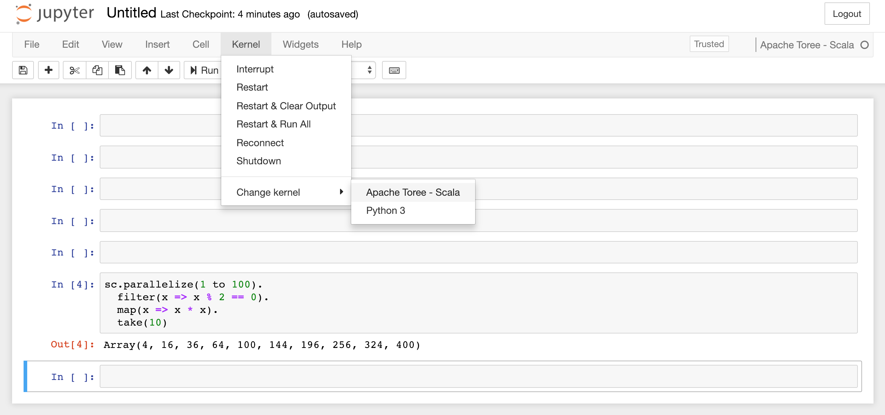

# Spark Setup MacOS Guide

Reference:
https://spark.apache.org/docs/latest/


## Summary:

How to setup Spark and integrate Jupyter Notebook with Spark using [Apache Toree](https://toree.apache.org/). The goal is to allow developers write Scala/Python to talk to Spark through Jupyter Notebook.


## 1. Install Java.

* Download and install Java 8 through brew.
```
brew cask install java8
```

*  Validate Java version
```
brew cask info java8
```

```shell
java8: 1.8.0_192-b12,750e1c8617c5452694857ad95c3ee230
https://www.oracle.com/technetwork/java/javase/downloads/jdk8-downloads-2133151.html
/usr/local/Caskroom/java8/1.8.0_192-b12,750e1c8617c5452694857ad95c3ee230 (246.2MB)
From: https://github.com/Homebrew/homebrew-cask-versions/blob/master/Casks/java8.rb
==> Name
Java Standard Edition Development Kit
==> Artifacts
JDK 8 Update 192.pkg (Pkg)
...
```

* Add java environment variables to terminal
    * Open Vim
    ```bash
    # Depending on terminal one might be using
    vim ~/.zshrc
    ```

    * Add the following to `.zshrc`
    ```bash
    # For Apache Spark
    if which java > /dev/null; then export JAVA_HOME=$(/usr/libexec/java_home); fi
    ```

## 2. Install Apache Spark

Brew is Mac OS Package Manager, similar to `apt` (http://brew.sh/)

```shell
brew update 
brew install scala
brew install apache-spark
```

## 3. Setup Variables

* Assump Current spark version == `2.4.0`.
```bash
# For a ipython notebook and pyspark integration
if which pyspark > /dev/null; then
  export SPARK_HOME="/usr/local/Cellar/apache-spark/2.4.0/libexec/"
  export PYTHONPATH=$SPARK_HOME/python:$SPARK_HOME/python/build:$PYTHONPATH
  export PYTHONPATH=$SPARK_HOME/python/lib/py4j-0.10.4-src.zip:$PYTHONPATH
fi
```

* Up to this point, you should be able to launch `pyspark` and `scala-shell` from terminal.

## 4. Integrate Spark and Jupyter Notebook

* Install Python Env through `pyenv`, a python versioning manager.
```bash
pyenv install 3.6.7 

# Set Python 3.6.7 as main python interpreter
pyenv global 3.6.7

# Update new python
source ~/.zshrc

# Update pip from 10.01 to 18.1
pip install --upgrade pip
```
* (Optional) If you received `pyspark 2.4.0 requires py4j==0.10.7, which is not installed.`, fixed by:
```
pip install py4j==0.10.7
```

* Install Jupyter, Apache Toree
```bash
pip install jupyter toree
```

* Create a `kernel` in Jupyter for managing Spark

```bash
jupyter kernelspec list
# Available kernels:
#  python3   /Users/dat/.pyenv/versions/3.6.7/share/jupyter/kernels/python3
```

```bash
jupyter toree install --replace --spark_home=$SPARK_HOME
jupyter kernelspec list

# Available kernels:
#  apache_toree_scala    /Users/dat/Library/Jupyter/kernels/apache_toree_scala
#  python3               /Users/dat/.pyenv/versions/3.6.7/share/jupyter/kernels/python3
```

## Launch Jupyter Notebook and Test Our First Spark Application

```bash
jupyter notebook
```
* Remember to Select Toree as your main kernel


